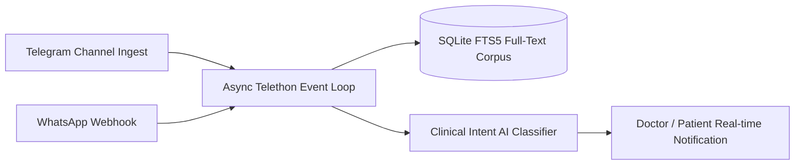

# StomChat — Architecture Specification

## 1. Asynchronous Ingestion & Telethon Client Pool
StomChat utilizes an asynchronous event-driven architecture based on Telethon, SQLite FTS5, and WebSockets.

## 2. Audio Transcoding & SIP VoIP Telephony
- Voice notes converted to 16kHz mono WAV for whisper transcription.
- SIP VoIP G.711u audio streams decoded directly via Web Audio API.
