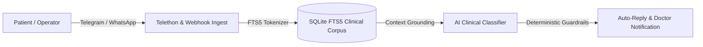

# 📡 StomChat — Omnichannel Clinical Knowledge & Telephony Platform

[](https://marko1olo.github.io/stomchat/)
[](https://marko1olo.github.io/stomchat/manifest.json)
[](https://marko1olo.github.io/stomchat/llms.txt)
[](https://www.python.org/)
[](https://github.com/LonamiWebs/Telethon)
[](https://www.sqlite.org/)

High-throughput clinical communication platform combining asynchronous Telegram channel dispatch, WhatsApp webhooks, Asterisk/FreePBX SIP VoIP telemetry, and full-text search (FTS5) knowledge extraction for multi-clinic dental networks.

---

## 🏛️ System Architecture



---

## 🔬 Core Modules

1. **Omnichannel Messaging:** Real-time bi-directional sync across Telegram, WhatsApp, and Web Chat with under 60-second response SLAs.
2. **VoIP SIP Telephony Engine:** In-browser G.711u call notifications, Caller ID lookup, and instant speech-to-text transcripts.
3. **AI Clinical Assistant:** Context-grounded auto-reply generator with empathetic and emergency triage modes.
4. **Digest Delivery Pipeline:** Automated patient reminders, pre-op prep instructions, and post-surgery care checklists.

---

## 🛠️ Quickstart

```bash
git clone https://github.com/marko1olo/stomchat.git
cd stomchat
python -m venv venv
source venv/bin/activate
pip install -r requirements.txt

# Run knowledge ingestion and worker
python main.py
```

---

### 👨‍💻 Lead Architect
**Адольф Петушков (Adolf Petushkov)** — High-Concurrency Systems & Clinical AI Architecture.  
GitHub: [@marko1olo](https://github.com/marko1olo)
