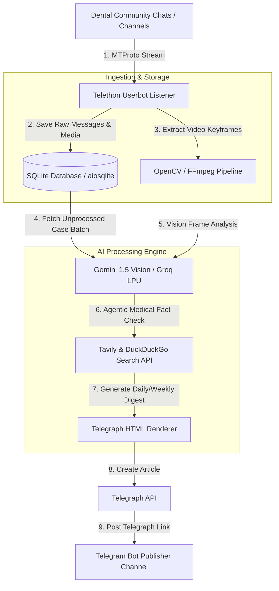

<div align="center">

# StomChat — Dentistry Chat Knowledge Base & AI Telegram Bot

### *Autonomous Multimodal Dental Case Listener, Agentic Fact Checker, and Telegraph Digest Publisher*

[](https://www.python.org/)
[](https://github.com/LonamiWebs/Telethon)
[](https://docs.pyrogram.org/)
[](https://deepmind.google/technologies/gemini/)
[](https://groq.com/)
[](https://sqlite.org/)
[](LICENSE)
[](https://marko1olo.github.io/stomchat/)
[](https://github.com/marko1olo/stomchat/actions)

<br />


<br />

[Features](#-key-features) • [Architecture](#-architecture--data-flow) • [Component Matrix](#-file-tree--component-matrix) • [Tech Stack](#%EF%B8%8F-tech-stack) • [Quick Start](#-getting-started) • [Original Docs](#-original-developer-documentation)

</div>

---

## ⚡ Overview

**StomChat** is a hybrid Telegram Userbot + Bot system powered by Google Gemini and Groq. It automatically archives dental community chat messages, analyzes media files (images, clinical photos, X-rays, videos), uses agentic search APIs to verify facts, and publishes daily/weekly AI-synthesized digests and knowledge articles to Telegraph and Telegram channels.

---

## 🚀 Key Features

### 📡 1. Hybrid Telegram Client Architecture
- **Userbot Listener**: Listens to targeted dental chats, groups, and channels to archive messages and media into SQLite.
- **Bot Publisher**: A dedicated bot client that formats, drafts, and posts summarized digests and Telegraph pages without cluttering your personal userbot session.

### 🧠 2. AI Summaries & Digests
- **Daily Digest**: Auto-compiles daily summaries from dental chat discussions (focusing on cases, queries, clinic issues).
- **Weekly Newspaper**: Formulates a structured weekly report on dentistry developments and discussed clinical cases.
- **Powered by Gemini & Groq**: Dynamic multi-key API rotation with built-in cooldowns for 429/timeouts.

### 🔍 3. Agentic Fact-Checking & Search
- Integrates **Tavily Search API** and **DuckDuckGo API** to perform web searches, verify claims made in dental chats, and add authoritative medical references.

### 🖼️ 4. Multimodal Media Analysis (AI Vision)
- **Automatic Frame Extraction**: Leverages `OpenCV` and `FFmpeg` to extract keyframes from uploaded clinical videos.
- **X-Ray & Photo Inspection**: Inspects dental X-rays, clinic setups, and dental photographs using multimodal Gemini Vision models.

### 📑 5. Telegraph Integration
- Automatically compiles long discussions into beautifully formatted Telegraph articles using `html-telegraph-poster` and publishes them to channels.

---

## 📐 Architecture & Data Flow



---

## 📂 Runtime Map

The repository is organized as a focused Python application rather than a set of package directories. The startup path, operational services, and test coverage below reflect the files that are actually present in the codebase.

| Component | Primary responsibility |
| :--- | :--- |
| `main.py` | Starts the database, Telethon listener, bot client, history synchronization, scheduler, recovery workers, and runtime watchdogs. |
| `assistant.py`, `summarizer.py`, `distiller.py` | Build assistant replies, daily summaries, and long-form digest material. |
| `gemini_client.py`, `gemini_knowledge.py`, `vision.py` | Coordinate LLM, knowledge, and multimodal analysis paths. |
| `search_engine.py`, `search_engine_safe.py`, `web_lookup.py` | Retrieve and validate external context for answer and digest workflows. |
| `media_tools.py`, `visionproc.py`, `videosi.py` | Process media, recover analysis jobs, and prepare visual inputs. |
| `database.py`, `taxonomy.py`, `dental_vocab.py` | Persist chat knowledge and keep dental terminology structured. |
| `runtime_guard.py` | Maintains heartbeats, watchdog diagnostics, and safe recovery state. |
| `test_*.py`, `run_all_tests.py` | Provide regression coverage for configuration, delivery, media, safety, scheduling, and summarization behaviour. |
| `assets/`, `docs/` | Contain the public documentation banner and generated project documentation. |

---

## 🛠️ Tech Stack

- **Core**: Python 3.10+
- **Telegram Protocol**: [Telethon](https://github.com/LonamiWebs/Telethon) (MTProto Client) & Pyrogram
- **LLM / Vision**: Google GenAI SDK (Gemini 1.5 Pro/Flash), Groq, OpenAI API
- **Web Search Tools**: Tavily API, DuckDuckGo Search API
- **Video & Image Processing**: OpenCV, Pillow, FFmpeg
- **Database**: SQLite (via `aiosqlite`)
- **Telemetry & Process Guard**: `psutil`, custom heartbeat watchdog

---

## 📦 Getting Started

### 📋 Prerequisites

- Python 3.10 or newer.
- Telegram API credentials from [my.telegram.org](https://my.telegram.org/).
- A Telegram bot token.
- At least one configured AI provider key for summary generation.
- FFmpeg on the system path when the media-processing workflows are enabled.

### ⚙️ Installation

1. **Clone the repository and install dependencies**:
   ```bash
   git clone https://github.com/marko1olo/stomchat.git
   cd stomchat
   pip install -r requirements.txt
   ```

2. **Create the local configuration module**. The application imports `config.py`; the committed `config.example.py` is the complete, safe template and `config.py` remains untracked:
   ```bash
   cp config.example.py config.py
   ```

3. **Create `.env` next to `config.py`**. The following values are required for a functional Telegram connection:
   ```env
   TG_BOT_TOKEN=your-telegram-bot-token
   TG_API_ID=your-telegram-api-id
   TG_API_HASH=your-telegram-api-hash
   TG_SESSION_NAME=stomchat
   ```

   Add the chat and delivery configuration that matches your deployment. `REPORT_TARGETS` is a JSON array; an empty array intentionally disables digest delivery.
   ```env
   SOURCE_CHAT_ID=-1000000000000
   REPORT_CHAT_ID=-1000000000000
   REPORT_TARGETS=[{"chat_id":-1000000000000,"topic_id":null}]
   REPORT_HOUR=20
   ```

   Configure at least one model provider. Model names are environment-driven so deployments can follow provider availability without source changes.
   ```env
   GOOGLE_API_KEYS=key-one,key-two
   GROQ_API_KEYS=optional-groq-key
   GEMINI_MODEL=your-selected-gemini-model
   GROQ_MODEL=your-selected-groq-model
   ```

   Optional integrations include `TELEGRAPH_TOKEN`, `SEARCH_PROVIDER`, and `TAVILY_API_KEY`. See `config.example.py` for their exact semantics and for the full configuration contract.

4. **Run the bot**:
   ```bash
   python main.py
   ```

---

## 📄 Original Developer Documentation

The text below represents 100% of the original pre-agent developer documentation preserved verbatim from repository initial commit history:

```markdown
### StomChat (Original Developer Documentation)

[](https://www.python.org/)
[](https://github.com/LonamiWebs/Telethon)
[](https://deepmind.google/technologies/gemini/)
[](https://groq.com/)

StomChat is a hybrid Telegram Userbot + Bot system powered by Google Gemini and Groq. It automatically archives dental community chat messages, analyzes media files (images, clinical photos, X-rays, videos), uses agentic search APIs to verify facts, and publishes daily/weekly AI-synthesized digests and knowledge articles to Telegraph and Telegram channels.
```

---

<details>
<summary><b>🇷🇺 Краткое описание на русском</b></summary>

### StomChat — ИИ-система архивации и анализа стоматологических чатов

**StomChat** — гибридный комплекс из Telegram-юзербота и публикатора (Telethon/Pyrogram), предназначенный для автоматического сбора, AI-анализа и каталогизации профессиональных стоматологических дискуссий, рентген-снимков и клинических кейсов.

#### Ключевые возможности:
- **Архивация со сбором медиа**: Слушатель (Telethon MTProto) автоматически сохраняет сообщения, клинические фотографии, дентальные снимки и видео из профессиональных каналов в БД SQLite.
- **Мультимодальный AI-анализ (Gemini Vision & OpenCV)**: Извлечение ключевых кадров из видео (OpenCV/FFmpeg) и автоматический анализ рентгенограмм и снимков через Google Gemini Vision.
- **Агентская валидация фактов (Tavily & DuckDuckGo)**: Проверка утверждений из чатов через поисковые API с добавлением ссылок на медицинские источники.
- **Дайджесты и Telegraph-статьи**: Генерирует ежедневные сводки и еженедельные выпуски "Dental Newspaper", публикуя их на платформе Telegraph через `html-telegraph-poster`.
- **Каскад API-ключей Gemini и Groq**: Автоматическое переключение между ключами при лимитах 429.
</details>
