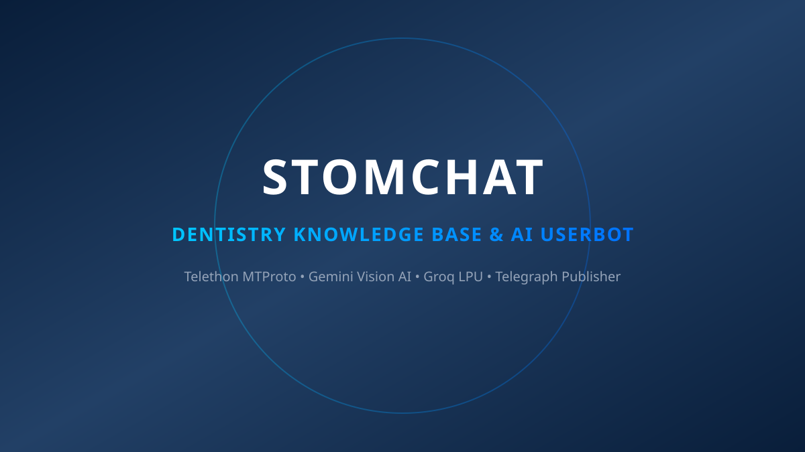
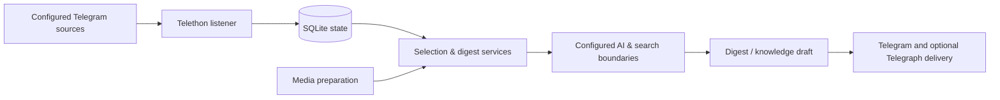

<div align="center">

# StomChat

**A Telegram knowledge-workflow prototype for dental community discussions.**

StomChat combines a Telethon listener, local SQLite storage, configurable LLM and search-provider paths, media preparation, and digest delivery into one inspectable Python project. It is an evolving automation workflow, **not** a medical device, diagnostic system, or source of clinical advice.

[](https://www.python.org/)
[](https://github.com/LonamiWebs/Telethon)
[](https://ai.google.dev/)
[](https://groq.com/)
[](https://sqlite.org/)
[](https://marko1olo.github.io/stomchat/)

[**Public project surface**](https://marko1olo.github.io/stomchat/) · [**Workflow**](#workflow) · [**Repository map**](#repository-map) · [**Run locally**](#run-locally) · [**Verification**](#verification)



</div>

---

## Why the project exists

Professional dental conversations can include useful operational context, questions, source links, and media references — but the path from a chat stream to a useful digest is more than a single model call. StomChat keeps the major steps visible in the repository: message collection, local persistence, selection and summarization, optional external context lookup, media preparation, and delivery.

> **Scope boundary.** The project can organize and summarize conversation material, but it must not be treated as a diagnosis engine, an authoritative medical reference, or a substitute for qualified clinical review. Protect patient information, follow consent and local policy, and validate any externally sourced medical statement before acting on it.

| Concern | Repository direction | Important boundary |
| --- | --- | --- |
| **Collection** | Telethon-based listening and configured chat ingestion. | A deployment needs appropriate Telegram access and permission to process its sources. |
| **Knowledge flow** | SQLite-backed local state, vocabulary, taxonomy, and digest-oriented services. | Local storage still needs deployment-specific access control and retention decisions. |
| **AI processing** | Configurable Gemini, Groq, and OpenAI-compatible integration paths. | Provider availability, model behavior, and output quality are not guaranteed by this repository. |
| **External context** | Search-oriented paths using configured providers. | Search results are leads for review, not automatically authoritative evidence. |
| **Media handling** | Image and video preparation paths using Pillow and OpenCV dependencies. | No README claim represents clinical interpretation of imagery. |
| **Publishing** | Telegram and optional Telegraph delivery routes. | Publish only material that has the appropriate review and destination configuration. |

---

## Workflow



The diagram is a **source-level map**. It shows how the codebase separates responsibilities; it does not promise that every provider is configured, that every route is live, or that generated output is clinically correct.

---

## Repository map

StomChat is organized as a focused Python application. Rather than hiding the system behind a large package hierarchy, the root modules expose the major operational boundaries directly.

| Area | Primary paths | Role in the workflow |
| --- | --- | --- |
| **Startup and runtime** | `main.py`, `runtime_guard.py` | Starts services, coordinates lifecycle checks, and holds runtime watchdog-oriented logic. |
| **Collection and state** | `database.py`, `taxonomy.py`, `dental_vocab.py` | Persists project state and keeps dental vocabulary and categorization explicit. |
| **Summaries and assistance** | `assistant.py`, `summarizer.py`, `distiller.py` | Builds assistant and digest-oriented text paths. |
| **Model and knowledge clients** | `gemini_client.py`, `gemini_knowledge.py`, `vision.py` | Connects configured model and knowledge-processing boundaries. |
| **Search and verification support** | `search_engine.py`, `search_engine_safe.py`, `web_lookup.py` | Retrieves external context for review-oriented workflows. |
| **Media paths** | `media_tools.py`, `visionproc.py`, `videosi.py` | Prepares and recovers media-related jobs and visual inputs. |
| **Regression coverage** | `test_*.py`, `run_all_tests.py` | Covers configuration, delivery, media, safety, scheduling, and summary behavior. |
| **Public surface** | `docs/`, `assets/` | Holds the static project presentation and documentation assets. |

### Confirmed declared dependencies

| Layer | Dependencies present in `requirements.txt` |
| --- | --- |
| **Telegram and configuration** | `telethon`, `python-dotenv` |
| **Storage and networking** | `aiosqlite`, `httpx` |
| **Model clients** | `google-genai`, `groq`, `openai` |
| **Search helpers** | `ddgs`, `tavily-python` |
| **Media and publishing** | `Pillow`, `opencv-python`, `html-telegraph-poster` |

---

## Run locally

### Prerequisites

Use Python 3.10 or newer. The active deployment will need Telegram API credentials, a bot token, and at least one configured model provider for AI-backed paths. Media workflows may require system-level tooling appropriate to the implementation and deployment environment.

```bash
# Clone and isolate the environment
git clone https://github.com/marko1olo/stomchat.git
cd stomchat
python -m venv .venv
source .venv/bin/activate
pip install -r requirements.txt

# Create the local, untracked configuration module
cp config.example.py config.py
```

Create `.env` next to `config.py` and use `config.example.py` as the authoritative configuration contract. At minimum, a functional Telegram connection requires the following shape:

```env
TG_BOT_TOKEN=replace-with-your-bot-token
TG_API_ID=replace-with-your-api-id
TG_API_HASH=replace-with-your-api-hash
TG_SESSION_NAME=stomchat
```

Configure only the sources, delivery targets, provider keys, and optional integrations that the deployment actually needs. Keep tokens, session material, chat identifiers, and local state out of Git.

```bash
python main.py
```

---

## Verification

Run the project-wide Python test launcher after changes that cross runtime, storage, provider, media, or delivery boundaries.

```bash
python run_all_tests.py
```

For a narrow change, run the relevant focused test module and inspect the result. A successful import or static check is useful, but it does not replace real permission, provider, delivery, privacy, or browser-flow validation.

---

## Public documentation

The [GitHub Pages project surface](https://marko1olo.github.io/stomchat/) is a static guide to the project’s architecture and workflow. It includes an interactive system map and a non-clinical simulator explanation, but it does not connect to Telegram, model providers, databases, or real chat content.

<details>
<summary><strong>Кратко по-русски</strong></summary>

**StomChat** — развивающийся Python-проект для организации знаний из стоматологических Telegram-сообществ. В репозитории разделены сбор сообщений через Telethon, локальное хранение, подготовка медиа, модели и поисковые провайдеры, создание дайджестов и доставка в настроенные каналы.

Проект **не является** медицинским изделием, системой диагностики или источником клинических рекомендаций. Любые чувствительные данные, ключи, Telegram-сессии и идентификаторы чатов должны оставаться вне Git, а итоговые материалы требуют человеческой проверки.

</details>

---

<p align="center">
  <a href="https://marko1olo.github.io/stomchat/">Public project surface</a>
  ·
  <a href="https://github.com/marko1olo/stomchat">Repository</a>
</p>


---


---

## 👥 Engineering Syndicate & Core Team

Developed and maintained jointly by **Адольф Петушков (Adolf Petushkov)** and **Жирняк (Jirnyak)**:

| Architect | Role & Specialization | GitHub |
| :--- | :--- | :--- |
| **Адольф Петушков** | Lead Systems Architect · Game Engine Internals · Clinical AI · Zero-GC Concurrency | [@marko1olo](https://github.com/marko1olo) |
| **Жирняк (Jirnyak)** | Deep Tech Specialist · High-Performance Physics · N-Body & Quantum Systems · macOS HID | [@Jirnyak](https://github.com/Jirnyak) |

### 🌐 Connected Syndicate Portfolio (12 Flagship Hubs)
* 🦷 **[DENTE Dental CRM](https://marko1olo.github.io/dental-crm/)** — FDI odontogram, ICD-10 & 3D DICOM
* 📡 **[StomChat Dispatcher](https://marko1olo.github.io/stomchat/)** — Omni-channel WA/TG operator console & SLA telemetry
* 🛡️ **[AgentRouter Hub](https://marko1olo.github.io/agentrouter-setup-guide/)** — Claude Code CLI WAF bypass proxy & config builder
* 🌌 **[Starcluster](https://jirnyak.github.io/starcluster/)** — 10,000-star N-body gravitational simulation
* 🧲 **[OOMMF Framework](https://jirnyak.github.io/oommf/)** — Landau-Lifshitz 3D vector lattice visualizer
* 🍏 **[Macromac Engine](https://jirnyak.github.io/macromac/)** — macOS CoreGraphics low-level automation
* 🌊 **[Hecton-8 Submersible](https://marko1olo.github.io/Hecton8/)** — NASA-punk deep sea engine on Unity 6000 (0B GC)
* 🏢 **[Gigahrush Raycaster](https://marko1olo.github.io/gigahrush/)** — 2.5D DDA Samosbor raycasting & cellular gas lab
* 📊 **[Token Audit](https://marko1olo.github.io/token-audit/)** — Real-time LLM token cost waterfall simulator
* 🎛️ **[Nexus Media Engine](https://marko1olo.github.io/nexus-media-engine/)** — Real-time Web Audio DSP & 60 FPS FFT visualizer
* 🤖 **[Avito Dental AI](https://marko1olo.github.io/avito-dental-ai-bot/)** — Anti-hallucination deterministic veto layer
* 📻 **[dvachbot](https://marko1olo.github.io/dvachbot/)** — Imageboard scraper & Atkinson dithering transcoder
